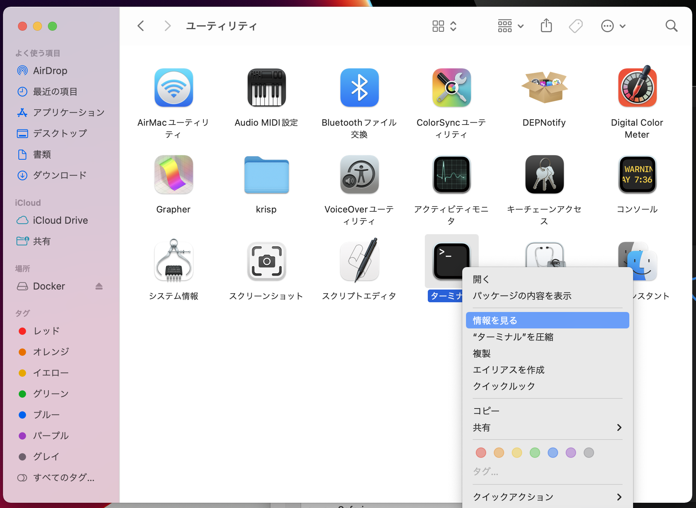
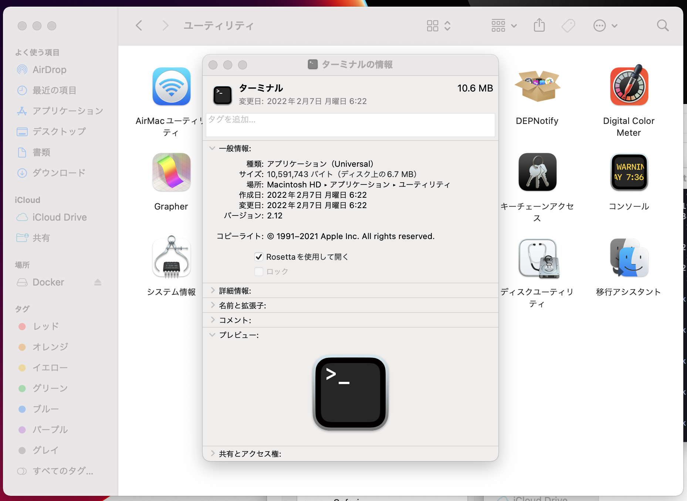

M1 Mac の環境で `goenv install 1.11.13` で何も実行されずに終了してしまうので対応しました。
anyenv から導入した goenv なので、そうじゃない場合は諸々違うかも。
ただし、そもそも Go.1.15 以前は M1 Mac での動作は保証されていないはずなので注意されたし。

## 結論

ターミナルを Rosseta2 で起動する

`$ arch -x86_64 goenv install 1.11.13` で実行するほうが早そうだし、設定を元に戻す手間も少なさそうで良さそうです(2022/2/28 16:00 追記)( thx [@rinsuki](https://github.com/rinsuki) )

## メモ

以下のように実行しても何も表示されず、当然 Go1.11.13 は使えないという状況

```sh
$ goenv install 1.11.13

# 何も表示されず...
```

まず M1 Mac でのトラブルは Rosseta2 で試してみようとのことなので Rosseta2 を導入してみる

```sh
$ softwareupdate --install-rosetta
```

ターミナルを Rosseta2 で起動するように設定する





ターミナルを起動して goenv を叩く

```sh
$ goenv install 1.11.13

# goenv が正常に動く
```
