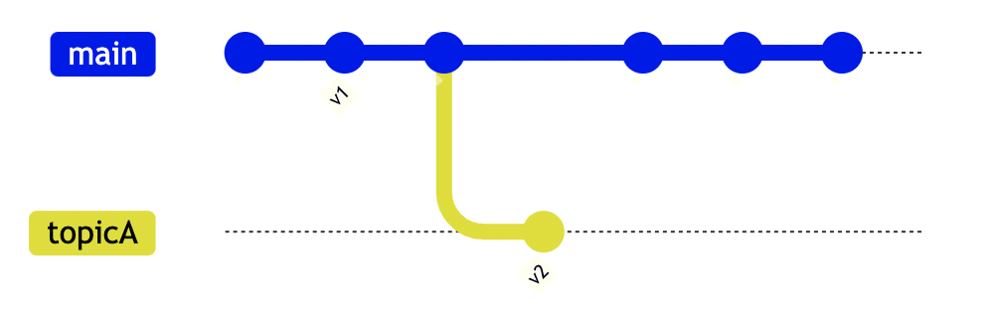

例えば tag でソフトウェアのリリースのバージョンを作っているとしましょう。
そこで最新の tag を取得することで、最新のリリースを取得することができます。
git describe コマンドを用いることで最新の tag を取得できますが、これは現在のブランチに限定された話です。
違うブランチにて最新の tag が打たれている場合は正しく動作しませんので、少し工夫が必要です。

## 結論

```
# 現在のブランチの最新タグ(lightweight tag を含む)を取得する場合
$ git describe --abbrev=0 --tags
v1

# 全てのブランチにおける最新タグ(lightweight tag を含む)を取得する場合
$ git describe --tags `git rev-list --tags --max-count=1`
v2
```

## Memo

まずは現在のブランチの最新タグを取得する場合を考えます。

`git describe <commit-ish>` は `<commit-ish>` から辿れる最新タグを表示するコマンドです。
`<commit-ish>` は省略することができ、その場合は `HEAD` 、要するに最新の commit になります。

また、 `git describe` は通常は以下のようなフォーマットで返します。

```
タグ名-コミット回数-gコミットのハッシュ値
```

たとえば以下のようになった場合を考えます。

```
$ git describe
v1-22-gxxxyyyzz
```

結果は以下のように読むことができます。

- タグ名: v1
- コミット回数: HEAD は v1 から 22回 commit された場所にある
- コミットのハッシュ値: HEAD は xxxyyyzz

ですが、今回は tag の名前のみ必要ですので、`--abbrev=0` を指定します。

```
$ git describe --abbrev=0
v1
```

ここでもう一つ、 tag には annotated tag と lightweight (non-annotated) tag といったものがあります。
今回はどちらのタグも対象にしたいので `--tags` もつけておく必要があります。

```
$ git describe --abbrev=0 --tags
v1
```

次に、全てのブランチにおける最新タグを取得する場合ですが、以下のコマンドではいけません。

```
$ git describe --abbrev=0 --tags
v1
```

たとえば以下の場合だと、 main ブランチではなく topicA ブランチに最新 tag があります。
この場合においても HEAD から辿れるという制約を踏まえると v1 が最新になってしまい、も正しく動作しないわけです。



ここで、最新 tag の `<commit-ish>` を取得する必要がありますが、それは以下のように取得できます。
`git rev-list` については説明を省略しますが、ざっくり言うと、このコマンドを利用すれば最新 tag への参照を取得できます。

```
$ git rev-list --tags --max-count=1
aaaaaaaabbbbbbbbbbbcccccccc
```

`git rev-list` では tag 名を取得することができません。
しかし、これを `git describe <commit-ish>` に当てはめると tag 名を取得できるわけです。

ここで、現在のブランチの取得方法で利用した `--abbrev=0` は必要ありません。タグが打たれた commi 自体を `<commit-ish>` に指定した場合は、 `--abbrev=0` を指定したものと同様の結果が取得できるのです。

それを踏まえると最終的に以下のコマンドを叩くことで全てのブランチにおける最新タグ(lightweight tag を含む)を取得す流ことができます。

```
$ git describe --tags `git rev-list --tags --max-count=1`
v2
```